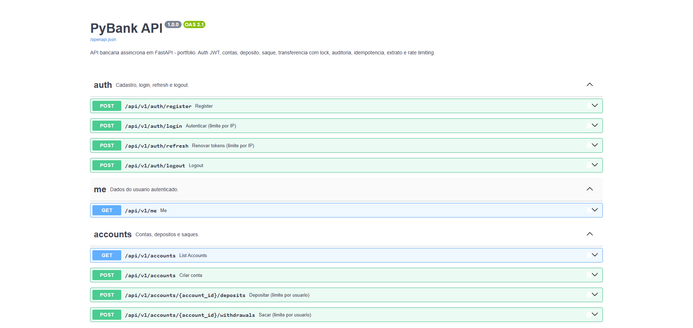

# PyBank — API Bancária Assíncrona

[](https://github.com/EnzoVieira3012/PyBank/actions/workflows/ci.yml)
[](https://github.com/EnzoVieira3012/PyBank)
[](https://www.python.org/)
[](LICENSE)

> **English?** [README.md](README.md)

API bancária assíncrona construída com FastAPI + PostgreSQL que processa depósitos e transferências **sem duplicar nem perder dinheiro sob concorrência**.

Esse é o projeto inteiro: **um workflow, não doze features**. Cada decisão de design (idempotência na constraint do banco, `SELECT ... FOR UPDATE` com ordem de lock fixa, `UPDATE ... RETURNING` atômico, trilha de auditoria) existe para sustentar um único invariante:

> **1 request = 1 efeito. Dinheiro nunca aparece duas vezes, nunca desaparece.**

---

## Arquitetura

```
                        ┌──────────────────────────────────────────────┐
                        │                 Client / Postman             │
                        └──────────────────────┬───────────────────────┘
                                               │ HTTPS / JSON
                                               ▼
                        ┌──────────────────────────────────────────────┐
                        │              FastAPI app (async)             │
                        │                                              │
                        │  RequestContextMiddleware ── correlation_id  │
                        │       │        │          │                  │
                        │       ▼        ▼          ▼                  │
                        │  CORS     security   RateLimiter             │
                        │  headers  headers    (janela 60s)            │
                        │                                              │
                        │              APIRouter /api/v1               │
                        │  auth · accounts · transfers · statements    │
                        └──────────────────────┬───────────────────────┘
                                               │
                                               ▼
                        ┌──────────────────────────────────────────────┐
                        │           Services (regras de negócio)       │
                        │  accounts · transfers · statements · audit   │
                        │  idempotency · auth                          │
                        └──────────────────────┬───────────────────────┘
                                               │ SQLAlchemy 2 (async)
                                               ▼
                        ┌──────────────────────────────────────────────┐
                        │           PostgreSQL 16 (banco único)        │
                        │                                              │
                        │  UNIQUE(user_id, key)  ── idempotência       │
                        │  CHECK (balance >= 0)   ── trava de oversell  │
                        │  tipos enum             ── sem strings soltas │
                        │  índice composto        ── extrato rápido     │
                        └──────────────────────────────────────────────┘
```

**As constraints vivem no banco, não na aplicação.** O app é o orquestrador; o banco é a fonte da verdade:

- `UNIQUE (user_id, key)` em `idempotency_keys` — dedup à prova de corrida no nível da constraint
- `CHECK (balance >= 0)` em `accounts` — backstop final contra oversell
- `enum` nativo do Postgres para tipos de transação — valor inválido é impossível
- `SELECT ... FOR UPDATE ... ORDER BY id` — ordem de lock determinística, deadlock impossível

---

## O problema

Operações bancárias são estatais e concorrentes. Dois retries do mesmo depósito, ou 100 saques simultâneos sobre um saldo — código ingênuo duplica dinheiro ou vende o que não tem.

O PyBank trata isso como **um workflow com três modos de falha**, cada um provado por teste:

| Falha | O que acontece | Prova |
|-------|----------------|-------|
| Mesmo request chega 2× | 1 efeito; 2ª resposta é replay byte-idêntico | teste de integração, mesma `Idempotency-Key` |
| Saldo muda concorrentemente | Só 1 operação vence; invariante mantido | corrida 100 vias, 5 ciclos |
| Saldo insuficiente | `409`, nada gravado | teste de integração (0 transactions, 0 audit rows) |

---

## Endpoints

| Método | Rota | Auth | Sucesso | Descrição |
|--------|------|------|---------|-----------|
| POST | `/api/v1/auth/register` | — | 201 | Cadastro |
| POST | `/api/v1/auth/login` | — | 200 | Login (rate limit por IP) |
| POST | `/api/v1/auth/refresh` | — | 200 | Rotação de tokens (rate limit por IP) |
| POST | `/api/v1/auth/logout` | sim | 204 | Revoga refresh token |
| GET | `/api/v1/me` | sim | 200 | Usuário atual |
| POST | `/api/v1/accounts` | sim | 201 | Cria conta |
| GET | `/api/v1/accounts` | sim | 200 | Lista contas |
| POST | `/api/v1/accounts/{id}/deposits` | sim | 201 | Depósito (rate limit por usuário) |
| POST | `/api/v1/accounts/{id}/withdrawals` | sim | 201 | Saque (rate limit por usuário) |
| POST | `/api/v1/transfers` | sim | 201 | Transferência (rate limit por usuário) |
| GET | `/api/v1/accounts/{id}/statement` | sim | 200 | Extrato paginado |
| GET | `/health` | — | 200/503 | Health check com ping real no DB |

Docs interativos: [Swagger UI](http://localhost:8000/docs) · [ReDoc](http://localhost:8000/redoc) · [OpenAPI JSON](http://localhost:8000/openapi.json)



Toda resposta de erro usa envelope uniforme (com `correlation_id` para correlacionar logs):

```json
{
  "detail": "mensagem legível",
  "status_code": 404,
  "path": "/api/v1/transfers",
  "method": "POST",
  "correlation_id": "uuid-v4"
}
```

| Status | Quando |
|--------|--------|
| 400 | Regra de negócio com body específico (ex.: transferência sem `Idempotency-Key`) |
| 401 | Credenciais inválidas / token expirado |
| 404 | Conta não encontrada (ou de outro usuário — nunca vaza existência) |
| 409 | Conflito: idempotency key em uso, saldo insuficiente, transferência p/ mesma conta |
| 422 | Validação Pydantic (envelope inclui `errors[]`) |
| 429 | Rate limit estourado (header `Retry-After`) |
| 500 | Erro inesperado — logado, nunca exposto |

---

## Tabela de falhas (o que acontece quando…)

| Falha | Comportamento | Prova |
|-------|---------------|-------|
| Mesmo body chega 2× (retry) | 1 efeito; 2ª resposta é replay byte-idêntico da resposta gravada; nada re-executa | `test_failure_matrix` — cenário duplicado |
| Mesma key, body diferente | `409 idempotency key reuse different payload` — payloads nunca se misturam | teste de integração |
| 2 requests concorrentes, mesma key | `UNIQUE(user_id, key)` + `INSERT ... ON CONFLICT DO NOTHING` — exatamente 1 executa; o outro recebe `409 request in progress` ou replay | teste de corrida |
| Saldo muda concorrentemente (100 ops simultâneas) | Só 1 operação vence por lock de linha; invariante `balance >= 0` mantido | `test_falha_corrida_100_saques...` — 100/100 sucessos, saldo final 0.00, 0 oversell, 5 ciclos |
| Saque/transferência > saldo | `409`, rollback total — 0 transactions, 0 audit rows | teste de integração — saldo insuficiente |
| Brute-force de login | Limite por IP: 10/min → `429` + `Retry-After` | testes de rate limit |
| Abuso de mutações | Limite por usuário: 100/min em depósitos/saques/transferências → `429` | testes de rate limit |
| Transferências A→B e B→A simultâneas | Ordem de lock fixa (`ORDER BY id`) — serializa, deadlock impossível | testes de transferência |
| Idempotency key expirada (TTL 24h) | Aceita como claim novo | teste de TTL |

---

## Decisões rejeitadas (ADR)

| Decisão | Opção rejeitada | Por quê |
|---------|-----------------|---------|
| **Postgres `UNIQUE` p/ idempotência** | Redis | Atomicidade na constraint, zero infra extra, durável entre restarts. Redis só paga com escala horizontal multi-instância — revisitar no deploy |
| **`SELECT ... FOR UPDATE` com ordem fixa** | Optimistic locking (coluna de versão) | Lock pessimista serializa o fluxo de caixa em 1 query; optimistic forçaria retry-fail do escritor perdedor. Optimistic vira viável em hot row única (contention altíssima) |
| **Paginação offset** | Cursor | Offset + índice composto basta no volume atual; cursor evita o deep-page scan acima de ~100k rows — trocar quando precisar |
| **`bcrypt` direto** | `passlib` | `passlib` quebra com `bcrypt>=4.1` (incompatibilidade conhecida); `bcrypt` direto é estável e tem menos dependências |

---

## Medições

### Corrida ×100 — 5 ciclos

Cenário: 1 conta com `100.00`, 100 saques concorrentes de `1.00`, via `asyncio.gather` + 100 `AsyncClient` independentes.

Sem o lock de linha, o teste estouraria o saldo (negativo). Com `SELECT ... FOR UPDATE ... ORDER BY id`:

| Ciclo | Saques 201 | Saldo final | Transações gravadas | Tempo |
|-------|------------|-------------|---------------------|-------|
| 1 | 100/100 | 0.00 | 100 withdrawals | < 60s |
| 2 | 100/100 | 0.00 | +100 | idem |
| 3 | 100/100 | 0.00 | +100 | idem |
| 4 | 100/100 | 0.00 | +100 | idem |
| 5 | 100/100 | 0.00 | +100 | idem |

Invariante: `dinheiro que entra = dinheiro que sai` em todo ciclo. Reproduzir: `python -m pytest tests/integration/test_failure_matrix.py`.

### Índice composto — antes / depois

Query: extrato de 1 conta (5.000 rows) filtrado por `type` + janela de data, `ORDER BY created_at DESC LIMIT 20` — com 10.000 transações seedadas.

| Índice | Plano | Tempo de execução |
|--------|-------|-------------------|
| Nenhum (só `account_id`) | Bitmap scan → filtro descartou 3.735 rows → sort top-N | **0.698 ms** |
| `(account_id, created_at DESC)` | Index scan na janela, filtro residual descartou só 38 rows, sem sort | **0.050 ms** — **~14× mais rápido** |

Migração: `a183cc6c2083_indice_composto_account_created_at`. Reproduzir: `python scripts/seed.py` → `EXPLAIN ANALYZE` com e sem o índice (`alembic downgrade -1` / `upgrade head`).

### Suíte de testes

94 testes · cobertura **96%** (meta ≥ 90%) · roda em Postgres 16 real (DB de teste `pybank_test`, isolado do dev) · 5 testes cirúrgicos cobrem os gaps que o fluxo feliz não alcança (JSON formatter, schemas pequenos, setup de logging).

```powershell
.venv\Scripts\python.exe -m pytest -q
.venv\Scripts\python.exe -m pytest --cov=src --cov-report=term-missing
.venv\Scripts\python.exe -m ruff check .
.venv\Scripts\python.exe -m mypy src
```

---

## Como rodar local

Requisitos: Docker (Postgres 16) + Python 3.13.

```powershell
# 1. env (nunca commitar segredos reais — copiar do template)
Copy-Item .env.example .env
#    preencher POSTGRES_*, DATABASE_URL, SECRET_KEY no .env

# 2. banco
docker compose up -d
.venv\Scripts\python.exe -m alembic upgrade head    # migrações, nunca create_all

# 3. API
.venv\Scripts\python.exe -m uvicorn src.main:app --reload
# http://localhost:8000/docs
```

Migrações são sempre explícitas (`alembic upgrade head`) — nunca `create_all` (síncrono, quebra com asyncpg). O CI aplica migrações por script; a corretude do schema é validada nos testes de integração.

### Postman

Collection com variáveis centralizadas — configure `baseUrl`, `apiEmail`, `apiSenha` uma vez; o `Login` preenche `accessToken`/`refreshToken` automaticamente; endpoints protegidos usam `Bearer {{accessToken}}`.

- [Download release asset](https://github.com/EnzoVieira3012/PyBank/releases/download/v0.4/PyBank.postman_collection.json)
- [Collection raw](https://raw.githubusercontent.com/EnzoVieira3012/PyBank/develop/docs/postman/PyBank.postman_collection.json)

### Variáveis de ambiente

| Variável | Default | Descrição |
|----------|---------|-----------|
| `APP_NAME` | `PyBank` | Nome da aplicação |
| `API_V1_STR` | `/api/v1` | Prefixo das rotas |
| `POSTGRES_USER` | *obrigatório* | Usuário do Postgres (`docker-compose` lê do `.env`) |
| `POSTGRES_PASSWORD` | *obrigatório* | Senha do Postgres — só no `.env`, nunca hardcoded |
| `POSTGRES_DB` | *obrigatório* | Nome do banco |
| `DATABASE_URL` | *obrigatório* | URL asyncpg completa |
| `SECRET_KEY` | *obrigatória* | Chave JWT — fail-fast se ausente ou `changeme` |
| `ACCESS_TOKEN_EXPIRE_MINUTES` | `30` | Validade do access token |
| `REFRESH_TOKEN_EXPIRE_DAYS` | `7` | Validade do refresh token |
| `RATE_LIMIT_LOGIN` | `10` | Logins por IP em janela de 60s |
| `RATE_LIMIT_MUTATIONS` | `100` | Mutações por usuário em janela de 60s |
| `CORS_ORIGINS` | `["http://localhost:8000"]` | Origens permitidas (lista JSON) |

---

## Mecanismos-chave

- **Idempotência**: header `Idempotency-Key` obrigatório em todos os POSTs mutáveis (ausente → 400). Mesma key + mesmo body → replay byte-idêntico gravado. Mesma key + body diferente → 409. A linha da key commita ou rola back **junto com** a operação — operação falhou, key liberada para retry.
- **Movimentação atômica**: depósito/saque usam `UPDATE ... RETURNING` único — sem read-modify-write, sem janela de corrida. Transferência trava as duas contas numa query (`FOR UPDATE ORDER BY id`), grava 2 linhas `Transaction` + débito + crédito num commit só, rollback total em qualquer erro.
- **Auth**: JWT access (30 min, HS256) + refresh token rotativo (7 dias, hasheado em repouso, `UNIQUE token_hash`). Logout revoga; rotação reusa o token antigo — reuso após rotação → 401.
- **Auditoria**: toda mutação grava `audit_logs` com `before`/`after` em JSON, IP do cliente e o `correlation_id` da request — rastro de compliance sem infra extra.

## Estrutura do projeto

```
src/
  main.py            # factory da app, envelope de erro, health check
  config.py          # settings via env (fail-fast no SECRET_KEY)
  middleware.py      # correlation_id, headers de segurança
  rate_limit.py      # janela in-memory (sem Redis, sem slowapi)
  controllers/       # camada HTTP: auth, accounts, transfers, statements
  services/          # regras de negócio: transfers, statements, idempotency, audit
  models/            # modelos SQLAlchemy (mixins UUID + timestamp)
  schemas/           # Pydantic v2
tests/
  integration/       # failure matrix, corrida ×100, idempotência, rate limits
```

## Licença e contato

[MIT](LICENSE) · Enzo Vieira — [LinkedIn](https://www.linkedin.com/in/enzovieiratrabalho/) · [GitHub](https://github.com/EnzoVieira3012) · [Email](mailto:enzovieira.trabalho@outlook.com)

*Projeto portfolio — Formação Python Backend Developer (DIO)*